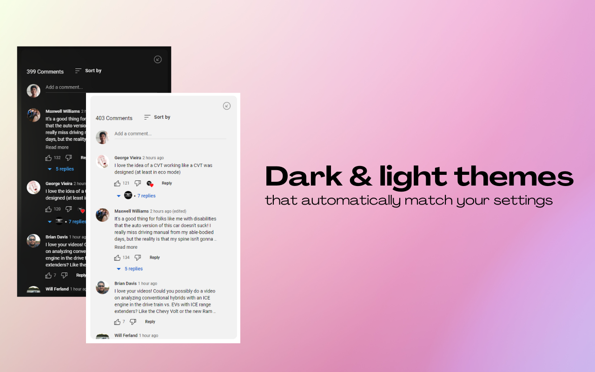
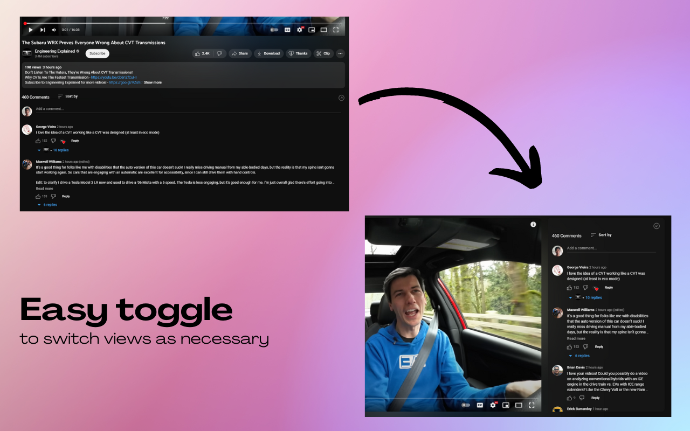

# Sidesy - Bring YouTube Comments To The Side

A Google Chrome extension that brings the comments section to the sidebar, enabling users to dive into the comments without scrolling past the video

## Installation

1. [Chrome App Store](https://chrome.google.com/webstore/detail/sidesy-bring-youtube-comm/mlceikceecooilkgiikkopipedhjjech)
2. [Local Installation](#local-installation)

## Features

1. Built for convenience with an eye for aesthetics. Unlike other similar options in the market, the sidebar comments don't feel out of place. They look nice and work well.
2. Dark & light modes depending on your YouTube settings.
3. Easy toggle integrated right into the comments section to easily switch between default and sidebar views.

## Showcase

## Local Installation

1. Clone the repo
2. Navigate to `chrome://extensions/` on a Chromium-based browser (Popular browsers: Google Chrome, Brave, Edge)
3. Turn on `Developer Mode` at the top right of the window.
4. Click on `Load Unpacked` on the top left, and navigate to the repo on your machine.
